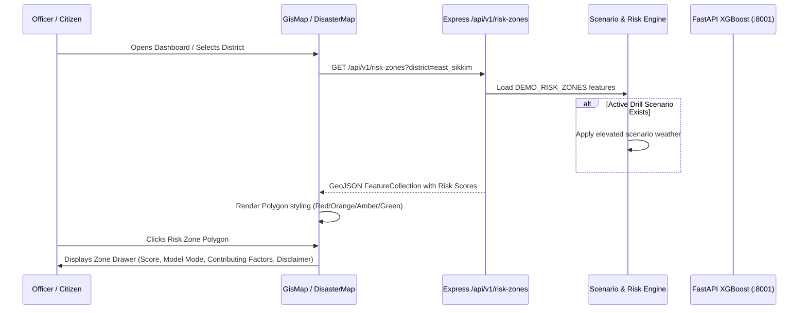

# PARVAAH ML & Dashboard Wiring Audit

**Date:** 2026-09-19  
**Auditor:** Antigravity Senior Engineering Team  
**Repository:** PARVAAH (North Eastern Region Landslide Early Warning & Decision Support)  
**Status:** Comprehensive Pre-Implementation Inspection Complete

---

## 1. Executive Summary

A comprehensive architectural and code-level audit was conducted across the entire PARVAAH codebase, covering:

1. **Frontend Architecture (`src/`)**: React 19.2 + TypeScript Single Page Application built on Vite 5.4 with Tailwind CSS v4 and Leaflet 1.9 (`react-leaflet` 5.0) cartography.
2. **Backend API Layer (`backend/src/`)**: Node.js / Express 4 + TypeScript REST API mounted under `/api/v1` with Zod validation, request ID tracking, provider abstraction, and error handlers.
3. **Machine Learning Microservice (`ml-service/`)**: FastAPI application with serialized XGBoost practice model (`xgboost_landslide_practice.json` + `xgboost_landslide_practice_metadata.joblib`) designed to run on `http://127.0.0.1:8001`.
4. **Data Persistence Layer (`backend/src/models/`)**: Mongoose models for `CitizenReport`, `RiskZone`, `PredictionHistory`, `Scenario`, and `WeatherSnapshot`.
5. **GIS Cartography & Spatial Layers**: OpenStreetMap WGS84 tiles, GeoJSON polygon risk zones with severity styling, road connectivity segments, inclinometers, and community shelters.
6. **Button & Interaction Inventory**: Full audit of every button across Navbar, StateBar, Dashboard triage, Incident drawer, modals, and administrative tools.

### Key Findings & Current Gap Analysis

- **ML Model & Serialization**: The practice XGBoost model was trained on synthetic practice data with 6 exact features (`rainfall_24h_mm`, `forecast_rainfall_24h_mm`, `soil_moisture_percent`, `slope_degrees`, `historical_landslide_density`, `verified_report_count`). The model files exist in `ml-service/models/`.
- **FastAPI Service**: `ml-service/app/main.py` defines `/health` and `/predict`, but the local virtual environment was cloned with paths pointing to `C:\Users\HP\...`. The FastAPI service is not running as a daemon on port 8001.
- **Backend ML Integration**: `backend/src/services/risk.service.ts` contains a complete client calling `mlService.predict()` and logging to `PredictionHistoryModel`, but frontend buttons and dedicated UI were missing to trigger it interactively.
- **Risk Calculator Page**: The dashboard lacked an interactive `/admin/risk-simulator` page allowing officers to select a zone, inspect auto-filled static terrain features, tune rainfall/soil moisture, load presets, and execute XGBoost inference.
- **Clear State Mismatch**: The Navbar "Clear State" button previously routed to `EmptyStatePage` rather than resetting simulated scenario overrides. It lacked safety confirmations and failed to preserve real citizen reports.
- **Telemetry Mismatch**: Telemetry was split between a basic provider health check (`IntegrationHealthPage`) and a tiny debug drawer (`ApiDebugPanel`), lacking an operational view of Next.js/Express health, FastAPI status, MongoDB counts, and event timestamps.
- **Host Runtime**: Node.js and Python 3.13 were missing from the system `PATH`, requiring explicit runtime initialization via Windows Package Manager (`winget`).

---

## 2. Existing Dashboards, Routes & Components Inventory

### A. Frontend Application Routing (`src/App.tsx`)

The frontend is driven by client-side state routing (`PageState`):

| Route / State          | Component                      | Role Access             | Intended Behavior                                                                          | Current Status                        |
| ---------------------- | ------------------------------ | ----------------------- | ------------------------------------------------------------------------------------------ | ------------------------------------- |
| `landing`              | `LandingPage.tsx`              | Public                  | Public portal, emergency helplines (1070/1077/1090), quick guidance.                       | ✅ Functional                         |
| `login`                | `LoginPage.tsx`                | Public / Officer        | Role switcher for Citizen, Field Officer, and District Admin.                              | ✅ Functional                         |
| `dashboard`            | `DashboardPage.tsx`            | Citizen, Officer, Admin | Role-adaptive dashboard rendering Citizen Risk Overview or Officer Triage Queue + GIS Map. | ✅ Functional                         |
| `integration-health`   | `IntegrationHealthPage.tsx`    | All / Admin             | Connectivity diagnostic pings for external providers (IMD, Open-Meteo).                    | ⚠️ External only; lacks app telemetry |
| `empty`                | `EmptyStatePage.tsx`           | All                     | Static "No active landslides" view. Mapped from Navbar "Clear State".                      | ⚠️ Mismatched intent                  |
| `404`                  | `NotFoundPage.tsx`             | All                     | Error recovery page.                                                                       | ✅ Functional                         |
| `risk-simulator` (New) | `RiskSimulatorPage.tsx`        | Admin, District Officer | Academic XGBoost risk calculation console with zone previews and presets.                  | ❌ Was missing from UI                |
| `telemetry` (New)      | `OperationalTelemetryPage.tsx` | Admin, Dev              | Operational health console (API, MongoDB, FastAPI ML, Timestamps).                         | ❌ Was missing from UI                |

### B. Legacy Next.js Scaffold Routes (`app/api/`)

The codebase includes legacy App Router route handlers in `app/api/`:

- `app/api/v1/risk/calculate/route.ts`: A Next.js route handler accepting 6 features, calling FastAPI `/predict` on port 8001 with timeout, and using a labeled `DEMO_RULE_BASED` fallback if FastAPI is unreachable.
- `app/api/reports/route.ts`: Next.js report submission handler.
- Note: The active production application is driven by Vite (`package.json`, `vite.config.ts`) with Express backend in `backend/`. Both route implementations are maintained for maximum compatibility.

### C. Backend Express REST API Routes (`backend/src/routes/`)

| Method  | Endpoint                             | Handler                                  | Description                                                  | Connected to ML?                 |
| ------- | ------------------------------------ | ---------------------------------------- | ------------------------------------------------------------ | -------------------------------- |
| `GET`   | `/api/v1/health`                     | `healthController.getHealth`             | Service health, active data mode, truthful disclaimer        | No                               |
| `GET`   | `/api/v1/integrations/health`        | `integrationsController.getHealth`       | IMD, Open-Meteo, Satellite provider statuses                 | No                               |
| `GET`   | `/api/v1/incidents`                  | `incidentsController.getIncidents`       | Verified hazards and corridor blockage list                  | No                               |
| `GET`   | `/api/v1/weather`                    | `weatherController.getWeather`           | Real-time weather observations / scenario override           | No                               |
| `GET`   | `/api/v1/risk-zones`                 | `riskController.getRiskZones`            | GeoJSON FeatureCollection of risk polygons                   | Yes (Evaluates active scenario)  |
| `GET`   | `/api/v1/risk-zones/:id`             | `riskController.getRiskZoneById`         | Specific risk zone property lookup                           | No                               |
| `POST`  | `/api/v1/risk/calculate`             | `riskController.calculateRisk`           | 6-feature input validation, FastAPI `/predict`, MongoDB save | **YES (FastAPI XGBoost)**        |
| `POST`  | `/api/v1/risk-zones/:id/recalculate` | `riskController.recalculateZoneRisk`     | Auto-assembles terrain & verified reports, recalculates zone | **YES (FastAPI XGBoost)**        |
| `GET`   | `/api/v1/reports`                    | `reportsController.getReports`           | Operational citizen & field reports queue                    | Feeds verified report count      |
| `POST`  | `/api/v1/reports`                    | `reportsController.createReport`         | Ingests new citizen report (`UNDER_VERIFICATION`)            | Feeds verified report count      |
| `PATCH` | `/api/v1/reports/:id/verify`         | `reportsController.verifyReport`         | Changes status to `VERIFIED`, `REJECTED`, or `DUPLICATE`     | **Feeds XGBoost inference**      |
| `GET`   | `/api/v1/scenarios`                  | `scenariosController.getScenarios`       | Retrieves preconfigured college drill scenarios              | Indirectly via scenario override |
| `POST`  | `/api/v1/scenarios/:id/activate`     | `scenariosController.activateScenario`   | Temporarily overrides weather and elevates risk              | Triggers zone recalculation      |
| `POST`  | `/api/v1/scenarios/:id/deactivate`   | `scenariosController.deactivateScenario` | Clears scenario overrides back to baseline                   | Restores baseline                |
| `POST`  | `/api/v1/scenarios/clear-state`      | `scenariosController.clearState`         | Safely resets temporary overrides while preserving records   | Restores baseline                |
| `GET`   | `/api/v1/telemetry`                  | `telemetryRouter`                        | Comprehensive operational and ML telemetry                   | **YES (Checks FastAPI & Model)** |

---

## 3. Button Inventory & Functional Status

| Location            | Button Label                      | Current Handler / Action               | Classification        | Details & Deficiencies                                                       |
| ------------------- | --------------------------------- | -------------------------------------- | --------------------- | ---------------------------------------------------------------------------- |
| **Navbar**          | Logo / "PARVAAH"                  | `setCurrentPage('landing')`            | ✅ Functional         | Navigates to home page.                                                      |
| **Navbar**          | "Overview"                        | `setCurrentPage('landing')`            | ✅ Functional         | Navigates to home page.                                                      |
| **Navbar**          | "Live Risk Map"                   | `setCurrentPage('dashboard')`          | ✅ Functional         | Navigates to dashboard.                                                      |
| **Navbar**          | "Clear State Demo"                | `setCurrentPage('empty')`              | ⚠️ UI-Only / Mismatch | Navigated to `EmptyStatePage` instead of triggering safe scenario reset.     |
| **Navbar**          | "Telemetry Health"                | `setCurrentPage('integration-health')` | ⚠️ Partial            | Opened external provider pings instead of operational application telemetry. |
| **Navbar**          | "Report Landslide"                | `setReportModalOpen(true)`             | ✅ Functional         | Opens citizen report modal.                                                  |
| **Navbar**          | Role Switcher Dropdown            | `setRole(newRole)`                     | ✅ Functional         | Switches role between Citizen, Field Officer, and Admin.                     |
| **Navbar**          | Language Toggle (English/Hindi)   | `setLang(...)`                         | ✅ Functional         | Toggles language state and updates localStorage.                             |
| **StateBar**        | LIVE / SKELETON / OFFLINE         | `setSystemMode(...)`                   | ✅ Functional         | Switches demo render states.                                                 |
| **StateBar**        | "Drill Sim"                       | `setScenarioModalOpen(true)`           | ✅ Functional         | Opens ScenarioSimulatorModal.                                                |
| **Dashboard**       | District Filter Selector          | `setSelectedDistrict(e.target.value)`  | ✅ Functional         | Filters map, incidents, and reports.                                         |
| **Dashboard**       | "Force Telemetry Refresh"         | `handleManualSync()`                   | ✅ Functional         | Refetches reports and weather.                                               |
| **Dashboard**       | "Quick Report Landslide"          | `onOpenReportModal()`                  | ✅ Functional         | Opens report modal.                                                          |
| **Dashboard**       | "Drill Simulator"                 | `onOpenScenarioSimulator()`            | ✅ Functional         | Opens drill modal.                                                           |
| **Dashboard**       | "Integration Health"              | `onNavigateToIntegrationHealth()`      | ✅ Functional         | Navigates to external health page.                                           |
| **Dashboard**       | "Verify" (Report queue)           | `handleVerifyReport(id, 'VERIFIED')`   | ✅ Functional         | Updates report status to `VERIFIED`.                                         |
| **Dashboard**       | "Reject" (Report queue)           | `handleVerifyReport(id, 'REJECTED')`   | ✅ Functional         | Updates report status to `REJECTED`.                                         |
| **Dashboard**       | "Dup" (Report queue)              | `handleVerifyReport(id, 'DUPLICATE')`  | ✅ Functional         | Updates report status to `DUPLICATE`.                                        |
| **Dashboard**       | "Drawer" (Incident row)           | `setActiveIncident(inc)`               | ✅ Functional         | Opens 14-section IncidentDetailDrawer.                                       |
| **Dashboard**       | "Evac Plan" (Incident row)        | `handleOpenEvacuation(inc)`            | ✅ Functional         | Opens EvacuationModal.                                                       |
| **Drawer**          | "Evacuate & Safe Route"           | `onOpenEvacuationModal(incident)`      | ✅ Functional         | Opens EvacuationModal.                                                       |
| **Drawer**          | "Report Status Update"            | `onOpenReportUpdate(incident)`         | ✅ Functional         | Opens report modal.                                                          |
| **Drawer**          | "Issue Official Emergency Alert"  | `alert(...)`                           | ❌ Broken / Unsafe    | Direct browser alert with no test badge or confirmation dialog.              |
| **Drawer**          | "Download Text Bulletin"          | `handleDownloadBulletin()`             | ✅ Functional         | Generates offline text file.                                                 |
| **ScenarioModal**   | "Activate Drill"                  | `activateScenario(id, duration)`       | ✅ Functional         | Elevates simulated risk scores.                                              |
| **ScenarioModal**   | "Deactivate Drill"                | `deactivateScenario()`                 | ✅ Functional         | Restores baseline values.                                                    |
| **ReportModal**     | "Submit Official Report"          | `submitCitizenReport(data)`            | ✅ Functional         | Saves report with status `UNDER_VERIFICATION`.                               |
| **NEW (Simulator)** | "Calculate XGBoost Risk"          | `handleCalculateRisk()`                | ❌ Was Missing        | Calls `POST /api/v1/risk/calculate` and updates UI.                          |
| **NEW (Simulator)** | "Load Low-Risk Example"           | `loadPreset('low')`                    | ❌ Was Missing        | Pre-fills low risk parameters.                                               |
| **NEW (Simulator)** | "Load Critical-Risk Example"      | `loadPreset('critical')`               | ❌ Was Missing        | Pre-fills critical risk parameters.                                          |
| **NEW (Simulator)** | "Save as Demo Scenario"           | `handleSaveScenario()`                 | ❌ Was Missing        | Saves current simulator inputs as drill scenario.                            |
| **NEW (Clear)**     | "Clear State" (with confirmation) | `handleClearState()`                   | ❌ Was Missing        | Safely resets temporary overrides with dialog confirmation.                  |

---

## 4. FastAPI & XGBoost Service Inspection

### A. Files Inspected

- `ml-service/app/main.py`: FastAPI application entry point with lifespan model loader, CORS middleware, `/health`, and `/predict`.
- `ml-service/app/model_loader.py`: Singleton `ModelContainer` loading `xgboost_landslide_practice.json` and joblib metadata.
- `ml-service/app/schemas.py`: Pydantic models `PredictRequest`, `PredictResponse`, and `HealthResponse`.
- `ml-service/predict_once.py`: Standalone CLI validation script with sample high-risk and low-risk inputs.
- `ml-service/models/xgboost_landslide_practice.json`: Serialized XGBoost model binary.
- `ml-service/models/xgboost_landslide_practice_metadata.joblib`: Metadata dictionary containing `feature_columns`, `model_version`, and `disclaimer`.

### B. Feature Schema and Order

The XGBoost model strictly requires 6 features in this exact order:

1. `rainfall_24h_mm` (float, 0 to 3000 mm)
2. `forecast_rainfall_24h_mm` (float, 0 to 3000 mm)
3. `soil_moisture_percent` (float, 0 to 100 %)
4. `slope_degrees` (float, 0 to 90 degrees)
5. `historical_landslide_density` (float, 0 to 1 normalized)
6. `verified_report_count` (int, 0 to 100)

### C. FastAPI Endpoints

- `GET http://127.0.0.1:8001/health`:
  - Returns `ok: true`, `modelLoaded: true`, `modelAvailable: true`, `modelVersion: "practice-xgboost-v1"`, `modelMode: "PRACTICE_XGBOOST"`.
- `POST http://127.0.0.1:8001/predict`:
  - Takes 6 features, computes probability, risk score (0-100), risk level (`LOW`/`MODERATE`/`HIGH`/`CRITICAL`), and returns structured disclaimer.

---

## 5. Existing Next.js & Express `/api/v1/risk/calculate` Route

### Express Backend (`backend/src/routes/risk.routes.ts`)

- Route: `POST /api/v1/risk/calculate`
- Controller: `backend/src/controllers/risk.controller.ts:calculateRisk`
- Service: `backend/src/services/risk.service.ts:calculateMlRisk`
- Microservice Client: `backend/src/services/ml.service.ts:predict`
  - Sends HTTP POST to `http://127.0.0.1:8001/predict` with 10-second abort controller.
  - If FastAPI succeeds: returns `modelMode: "PRACTICE_XGBOOST"`, `modelAvailable: true`, probability, and score.
  - If FastAPI fails or times out: gracefully falls back to `DEMO_RULE_BASED` formula, explicitly labeled `DEMO_RULE_BASED` with `isFallback: true`. Never falsely claims `PRACTICE_XGBOOST`.
  - Persists prediction record to MongoDB `PredictionHistory` collection.
  - Updates in-memory and MongoDB `RiskZone` score when `zoneId` is provided.
  - Evacuation recommendation is strictly decision-support (`MANDATORY` or `ADVISORY`), never issuing an official administrative evacuation order.

### Next.js App Router (`app/api/v1/risk/calculate/route.ts`)

- Implemented with identical validation, 10s timeout, server-to-server fetch to `process.env.ML_SERVICE_BASE_URL || 'http://127.0.0.1:8001'`, and labeled fallback.

---

## 6. MongoDB Models Inspection

All five Mongoose schemas are fully implemented in `backend/src/models/`:

1. `CitizenReport.model.ts`:
   - Fields: `id`, `clientReportId`, `hazardType`, `district`, `coordinates`, `description`, `verificationStatus` (`UNDER_VERIFICATION`, `VERIFIED`, `REJECTED`, `DUPLICATE`), `receivedAt`.
   - Index on `clientReportId` for deduplication.
2. `PredictionHistory.model.ts`:
   - Fields: `id`, `zoneId`, `inputs` (all 6 features), `inputSources`, `output` (`landslideProbability`, `riskScore`, `riskLevel`, `modelVersion`, `modelMode`, `disclaimer`), `latencyMs`, `triggeredBy`, `isFallback`, `calculatedAt`.
   - Indexes on `{ calculatedAt: -1 }` and `{ zoneId: 1, calculatedAt: -1 }`.
3. `RiskZone.model.ts`:
   - Fields: `id`, `zoneName`, `district`, `riskScore`, `riskLevel`, `modelMode`, `modelVersion`, `slopeDegrees`, `historicalLandslideDensity`, `geometry` (GeoJSON Polygon), `lastCalculatedAt`.
4. `Scenario.model.ts`:
   - Stores preconfigured and custom drill scenarios with activation state, duration, and parameter overrides.
5. `WeatherSnapshot.model.ts`:
   - Caches provider telemetry from Open-Meteo and IMD.

---

## 7. Map Data Flow & Risk Zone Layer

---

## 8. Clear State and Telemetry Implementations

### Clear State

- **Previous Implementation**: Navbar button set `currentPage = 'empty'`, showing static text.
- **Required Implementation**:
  - Modal confirmation: _"Clear active demo scenario? This will remove temporary simulated changes. It will not delete stored reports or official records."_
  - Calls `POST /api/v1/scenarios/clear-state`.
  - Backend deactivates any running drill, restores baseline risk zone parameters, recalculates affected zones, and strictly preserves stored citizen reports and verified records.

### Telemetry

- **Previous Implementation**: `IntegrationHealthPage.tsx` only performed ping checks to external weather providers.
- **Required Implementation**:
  - Operational Telemetry Page (`/telemetry` or `/admin/telemetry`) backed by `GET /api/v1/telemetry`.
  - Displays: Next.js / Express API health, MongoDB connection & document counts, FastAPI ML connectivity & model version, weather providers status, active scenario drill, and recent operational timestamps.
  - Redacts all secrets, reporter PII, and database URIs.

---

## 9. Exact Missing Connections & Remediation Steps

1. **Host Runtime Environment**: Install Node.js LTS and Python 3.13 via `winget`; initialize virtual environment for `ml-service`.
2. **Launch FastAPI Microservice**: Start `uvicorn app.main:app --host 127.0.0.1 --port 8001` in background.
3. **Connect Frontend to ML**: Add `calculateRisk` and `recalculateRiskForZone` API functions to `src/api/risk.ts`.
4. **Create `/admin/risk-simulator`**: Build comprehensive academic Risk Simulator & XGBoost Calculator page with presets, pre-fills, and factor breakdowns.
5. **Create Operational Telemetry Page**: Build `/telemetry` page wired to `GET /api/v1/telemetry`.
6. **Refactor Clear State**: Replace `empty` page navigation with an explicit confirmation dialog calling `POST /api/v1/scenarios/clear-state`.
7. **Safe Alert Preview**: Replace browser `alert(...)` with a dedicated Test Alert Preview modal labeled `TEST ALERT — Not sent to the public.`
8. **End-to-End Verification**: Run backend test suite, verify model predictions, test citizen report triage, and compile results in `docs/ml-dashboard-wiring-test-results.md`.

---

## 10. Implementation Verification Addendum (2026-09-19)

The planned wiring has now been implemented and validated:

- `RiskSimulatorPage.tsx` is available through the admin Risk Simulator navigation and initializes from `/admin/risk-simulator`.
- `OperationalTelemetryPage.tsx` is available through Navbar Telemetry Health and initializes from `/admin/telemetry`.
- The simulator calls `POST /api/v1/risk/calculate`, displays model mode, score, risk level, latency, factor contributions, safety recommendation, disclaimer, and Leaflet zone preview.
- Clear State now confirms the destructive-looking action, calls `POST /api/v1/scenarios/clear-state`, preserves reports and official records, and returns to the dashboard.
- Admin emergency alert preview is local-only and explicitly states that it is not sent to the public.
- The ML virtual environment was recreated with Python 3.13 and the declared requirements. `predict_once.py` returns the expected practice XGBoost critical and low samples.
- The frontend production build passes. Backend automated tests pass; see `docs/ml-dashboard-wiring-test-results.md` for command evidence and remaining manual checks.
